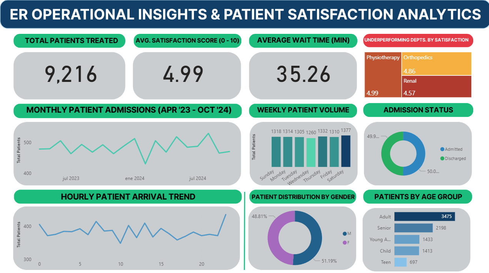

# ER-Efficiency-Insights-Dashboard
Healthcare analytics project evaluating ER operational efficiency and patient satisfaction using Power BI and Python.

## 🏥 ER Operational Insights & Patient Satisfaction Analytics

### 📌 Project Overview
This project explores emergency department efficiency by analyzing a dataset of 9,000+ patient records. As a **Clinical Efficiency Specialist** with a background in dentistry (DDS), I designed this tool to bridge the gap between raw healthcare data and actionable management decisions.

### 🔍 Key Discovery: The Correlation Gap
During the exploratory data analysis (EDA), I identified a **lack of statistical correlation** between Patient Wait Times and Satisfaction Scores. 

**Why this matters:**
In a real-world clinical setting, this would trigger an immediate audit of secondary factors, such as "Quality of Interaction with Staff" or "Perceived Pain Management," proving that efficiency isn't just about speed, but about the patient experience.

### 🛠️ Tech Stack & Skills

*   **Tool:** Power BI Desktop
*   **Data Transformation:** Python (Exploratory Data Analysis - EDA) & Power Query (ETL) for cleaning synthetic medical records.
*   **Analysis:** DAX measures for time-intelligence and dynamic KPI tracking.
*   **UX/UI:** Custom-built background for high-readability in clinical environments.
